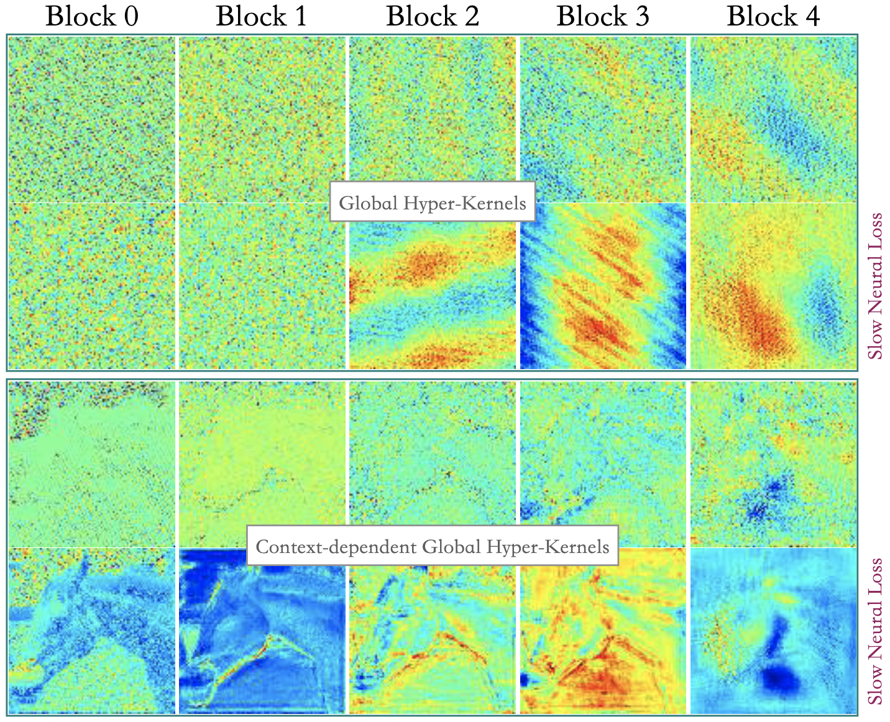

# Terminator (unfinished & rechecking...)
 
HyperZ⋅Z⋅W Operator Connects Slow-Fast Networks for Full Context Interaction (https://arxiv.org/pdf/2401.17948.pdf)


## Abstract
The self-attention mechanism utilizes large implicit weight matrices, programmed through dot product-based
activations with very few trainable parameters, to enable long sequence modeling. In this paper, we investigate the
possibility of discarding residual learning by employing large implicit kernels to achieve full context interaction at
each layer of the network. To accomplish it, we introduce coordinate-based implicit MLPs as a slow network to
generate hyper-kernels1 for another fast convolutional network2. To get context-varying weights for fast dynamic encoding, 
we propose a HyperZ·Z·W operator that connects hyper-kernels (W) and hidden activations (Z) through simple elementwise multiplication, 
followed by convolution of Z using the context-dependent W. Based on this design, we present a novel Terminator architecture that integrates
hyper-kernels of different sizes to produce multi-branch hidden representations for enhancing the feature extraction capability of each layer. 
Additionally, a bottleneck layer is employed to compress the concatenated channels, allowing only valuable information to propagate to the subsequent layers. 
Notably, our model incorporates several innovative components and exhibits excellent properties, such as introducing local feedback error for updating the slow
network, stable zero-mean features, faster training convergence, and fewer model parameters. Extensive experimental results on 
pixel-level 1D and 2D image classification benchmarks demonstrate the superior performance of our architecture.


<center>  </center>

## Updates

[01-07-2024] I will open source the code on 2D image tasks today. 


### Overall Architecture
- [x] No residual connections
- [x] A new variant of self-attention and FWP to get fast weights - `HyperZ⋅Z⋅W` operator
- [x] Defination of `Full-context Interaction`
- [x] A multi-branch structure - `Slow-Fast Neural Encoding (SFNE)` Block
- [x] A local `slow neural loss` to obtain accurate pixel-level scores (i.e. pixel-level "attention")
- [x] Replace Normlization with `Standardization`: no Affine parameters and Momentum argument
- [x] `Four new components`: G-IBS, RGU, Hyper-Channel Interaction, Hyper Interaction
- [x] `Excellent Properties`: faster training convergence, zero-mean features, fewer model parameters
- [x] New optimizers `Kar2` & `Kar3` are more suitable for slow-fast architectue
- [x] The width of NN is far greater than its depth (`5000 vs. 5`) 


### Installation

We provide an environment file ``environment.yml`` containing the required dependencies. Clone the repo and run the following command in the root of this directory:
```
conda env create -f environment.yml
```

### Expriments

#### Training commands
```shell
python main.py dataset.name="CIFAR100" optimizer.name="Kar3" optimizer.lr=0.00120925 optimizer.l2_reg=0.00004 optimizers.betas=[0.75, 0.99]
```

#### Testing commands
```shell
python main.py dataset.name="CIFAR100" train.do=False pretrained.load=True pretrained.filename='**'
```

If you want distrubuted training, please add: ```train.distributed=True, num_nodes=1, avail_gpus=4```


## Citation
If you use this codebase, or otherwise find our work valuable, please cite our paper:
```
@article{zhang2024hyperz,
  title={HyperZ⋅Z⋅W Operator Connects Slow-Fast Networks for Full Context Interaction},
  author={Zhang, Harvie},
  journal={arXiv preprint arXiv:2401.17948},
  year={2024}
}
```


## Acknowledgement
Thank [Alex Yanko](https://x.com/LeopolisDream) for posting this work on X ([twitter](https://x.com/LeopolisDream/status/1804627325583327358)), which attracts more attention. Harvie Zhang independently conducted this project, which commenced in October 2022 and received 1/4 of its funding from Innovation and Technology Fund. Our code is learned from [ccnn](https://github.com/david-knigge/ccnn). We hope our `Terminator` could promote the exploration of novel network architecture.


## Dicussion

If you have any suggestion or question, you can contact me by harviezzw@gmail.com. Thanks for your attention!
